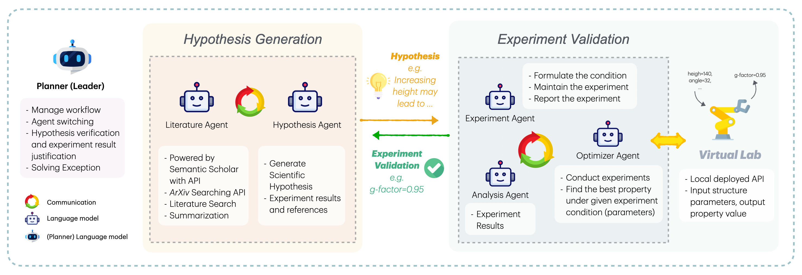
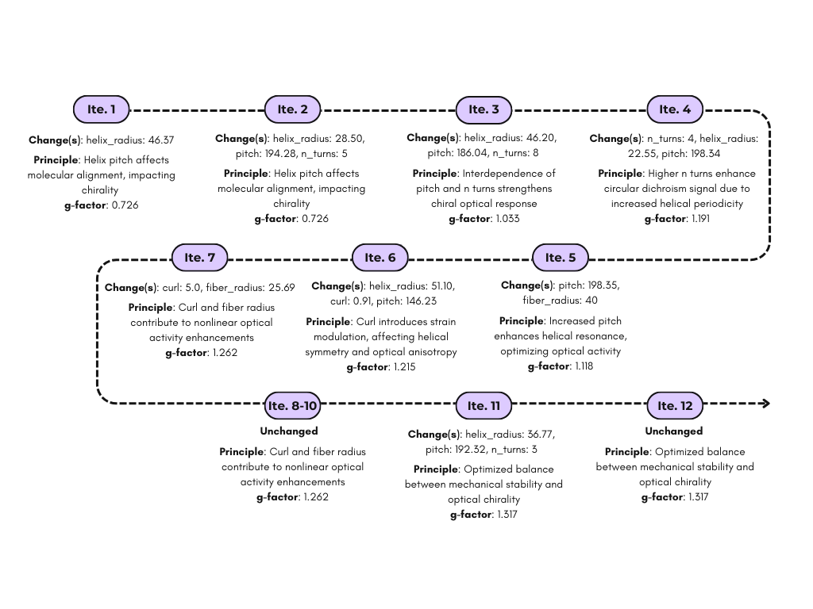

<div align="center">

<div align="center">
 
  <em>
      Overview of the PriM framework
  </em>
</div>

<h3>PriM: Principle-Inspired Material Discovery through Multi-Agent Collaboration</h3>


[Zheyuan Lai](https://fangggf.github.io/)*†, [Yingming Pu](https://kunjun-li.github.io/)‡† (Corresponding author)
 
*: National University of Singapore

‡: Westlake University and Zhejiang University

*†: Equal Contribution*

📄 [[PDF]](https://openreview.net/pdf?id=lhobZk76wX) | 💻 [[GitHub]](https://github.com/amair-lab/PriM)
</div>

<details>
<summary>📖 Abstract</summary>
Complex chemical space and limited knowledge scope with biases holds immense challenge for human scientists, yet in automated materials discovery. Existing intelligent methods relies more on numerical computation, leading to inefficient exploration and results with hard-interpretability. To bridge this gap, we introduce a principles-guided materials discovery workflow powered by language inferential multi-agent system (MAS). Our framework integrates automated hypothesis generation with experimental validation in a roundtable system of MAS, enabling systematic exploration while maintaining scientific rigor. Based on our framework, the case study of nano helix demonstrates higher materials exploration rate and property value while providing transparent reasoning pathways. This approach develops an automated-and-transparent paradigm for material discovery, with broad implications for rational design of functional materials.
</details>

## 👋 Overview
The PriM framework bridges the gap between traditional data-driven methods and principled scientific reasoning. It achieves this by combining:
- **Hypothesis Generation**: A Literature Agent retrieves relevant scientific knowledge, and a Hypothesis Agent formulates testable propositions based on physicochemical principles.
- **Experimental Validation**: An Experiment Agent designs and executes virtual experiments, while an Optimizer Agent refines the parameter space via Monte Carlo Tree Search (MCTS) to maximize the desired material property.
- **Transparent Reasoning**: All decision-making is traceable through explicit, human-readable reasoning paths, facilitating deeper insights into material behavior.

## 📑 Case Study
The system is demonstrated on a **nano helix material discovery** case study, where iterative agent collaboration results in significant improvements in material properties compared to conventional methods.

We set the research goal and constraints as the following:
- **Research Goal (task description)**: Find the structural parameters corresponding to the strongest chirality (g-factor characteristics) in the nanohelix material system.
- **Research Constraints**: Explicitly show the underlying physicochemical principles regarding the structure and property relationships.

<div align="center">
 
  <em>
      Step-by-Step Hypothesis Evolution in PriM.
  </em>
</div>

This figure illustrates the iterative refinement process where hypotheses and experimental conditions are systematically adjusted to optimize the nano helix's g-factor. It details 12 iterations, showing how changes to parameters—including helix radius, pitch, number of turns, fiber radius, and curl—are driven by underlying physicochemical principles such as structural stability, molecular alignment, and optical anisotropy. Each step records the principles behind the hypothesis, the changes of parameter values, and the achieved g-factor, highlighting key improvements and showcases PriM's ability to balance exploration and exploitation.

## 📁 Code Structure
```plaintext
├── baselines
│   ├── AccelMat
│   │   ├── accelmat_chat.json
│   │   ├── accelmat_feedback.json
│   │   ├── accelmat.py
│   │   ├── experiment_agent.py
│   │   └── optimizer.py
│   ├── MASTER
│   │   ├── config.yml
│   │   ├── main.py
│   │   ├── agents
│   │       ├── experiment_agent.py
│   │       └── hypothesis_agent.py
│   │   └── mcts
│   │       ├── node.py
│   │       └── search.py
│   ├── LLM-MAS-base.py
│   └── single-agent.py
├── src
│   ├── agents
│   │   ├── __init__.py
│   │   ├── analysis_agent.py
│   │   ├── experiment_agent.py
│   │   ├── hypothesis_agent.py
│   │   ├── literature_agent.py
│   │   ├── optimizer_agent.py
│   │   └── user_proxy_agent.py
│   ├── data
│   │   ├── chat_history.json
│   │   └── notes.json
│   ├── logs
│   │   └── prim.log
│   ├── utils
│   │   ├── data_analysis_tools.py
│   │   ├── exploration_rate.py
│   │   ├── g_v_ite.py
│   │   ├── inference.py
│   │   ├── logger.py
│   │   └── semantic_scholar_api.py
│   ├── __init__.py
│   ├── config.yml
│   └── inference.py
├── virtual_lab
│   ├── data
│   │   └── nanomaterials_g-factor.csv
│   ├── models
│   │   ├── best_model.pth
│   │   └── scaler.pkl
│   ├── src
│   │   ├── __init__.py
│   │   ├── data_processor.py
│   │   ├── model.py
│   │   ├── server.py
│   │   └── training.py
│   ├── __init__.py
│   ├── README.md
│   └── test_tool.py
├── LICENSE
├── README.md
└── requirements.txt
```

## 🛠 Setup

1. Clone this repository:
```bash
git clone https://github.com/amair-lab/PriM.git
cd PriM
```

2. Install required dependencies:
```bash
conda create -n PriM python=3.9
pip install -r requirements.txt
```

3. Start the Virtual Lab:
```bash
cd virtual_lab/src
python server.py
```

4. Run the PriM framework:
```bash
cd src
python inference.py config.yml
```

## 📚 Citation
```bibtex
@inproceedings{pu2025prim,
  title = {PriM: Principle-Inspired Material Discovery through Multi-Agent Collaboration},
  author = {Zheyuan Lai and Yingming Pu},
  booktitle = {ICLR 2025 Workshop on AI for Accelerated Materials Design},
  year = {2025},
  month = mar,
  url = {https://openreview.net/pdf?id=lhobZk76wX},
}
```